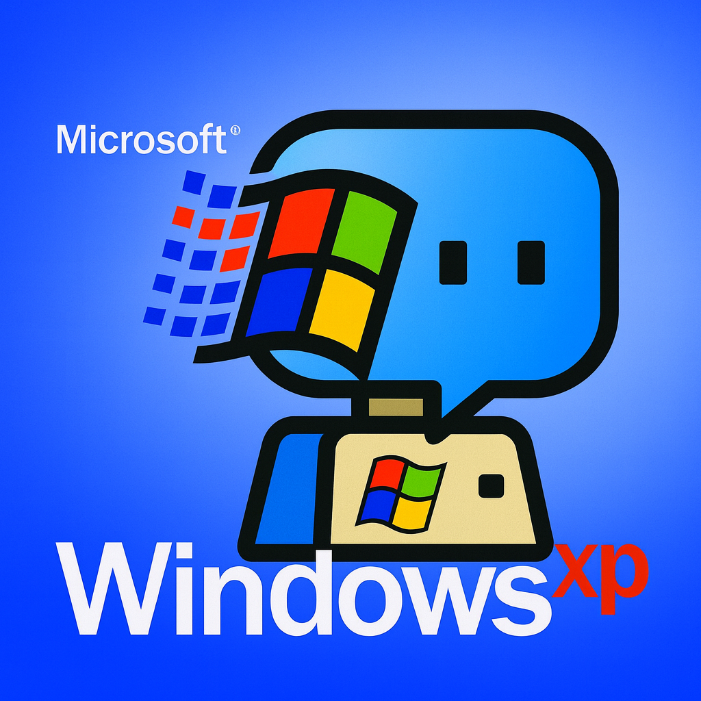

# Windows 95 ChatBot LLM

A nostalgic Windows 95-style chatbot with modern LLM integration. Experience the retro computing era with an AI assistant that speaks like a 1990s computer system.



## 🖥️ Features

- **Authentic Windows 95 UI**: Complete with title bars, menu bars, status bars, and classic button styling
- **Retro AI Personality**: The bot responds in ALL CAPS with robotic, technical language from the 1990s era
- **Real-time Chat**: Streaming responses with typing indicators
- **Classic Desktop Experience**: Taskbar, system info panel, and retro styling
- **LLM Integration**: Powered by OpenAI GPT-4 with custom retro personality prompts

## 🚀 Tech Stack

- **Frontend**: Next.js 14, React 18, TypeScript
- **Styling**: Tailwind CSS with custom Windows 95 theme
- **AI**: OpenAI GPT-4 API
- **Deployment**: Vercel

## 🎨 Design Features

- Authentic Windows 95 color scheme (`#008080` cyan background)
- Classic inset/outset border effects
- MS Sans Serif font styling
- Retro scrollbars and UI elements
- System-style chat interface with timestamps
- Desktop taskbar with Start button

## 🤖 Bot Personality

The chatbot embodies a 1990s computer assistant with:
- Formal, robotic communication style
- Technical jargon and computing references
- System-like response patterns
- References to RAM, CPU, disk drives, modems, and Windows 95
- Structured response formats with status messages

## 🛠️ Installation

1. **Clone the repository**:
   ```bash
   git clone https://github.com/TrendsAI-bit/wins95botllm.git
   cd wins95botllm
   ```

2. **Install dependencies**:
   ```bash
   npm install
   ```

3. **Set up environment variables**:
   Create a `.env.local` file:
   ```env
   OPENAI_API_KEY=your_openai_api_key_here
   ```

4. **Run the development server**:
   ```bash
   npm run dev
   ```

5. **Open your browser**:
   Navigate to `http://localhost:3000`

## 🌐 Deployment

### Vercel (Recommended)

1. Push your code to GitHub
2. Connect your repository to Vercel
3. Add your `OPENAI_API_KEY` environment variable in Vercel dashboard
4. Deploy!

### Other Platforms

The app can be deployed to any platform that supports Next.js:
- Netlify
- Railway
- DigitalOcean App Platform
- AWS Amplify

## 📁 Project Structure

```
wins95botllm/
├── app/
│   ├── api/chat/route.ts    # LLM API endpoint
│   ├── globals.css          # Windows 95 styling
│   ├── layout.tsx           # Root layout
│   └── page.tsx             # Main chat interface
├── public/
│   ├── logo.png             # Bot logo
│   └── logo-transparent.png # Transparent logo
├── package.json
├── tailwind.config.js       # Windows 95 theme
└── README.md
```

## 🎯 Usage

1. **Start Chatting**: Type your message in the input field and press Enter or click "SEND"
2. **Clear Chat**: Use the "CLEAR" button to reset the conversation
3. **System Info**: Check the side panel for system status and information
4. **Retro Experience**: Enjoy the authentic Windows 95 interface and robotic responses

## 🔧 Customization

### Modify Bot Personality
Edit the `RETRO_SYSTEM_PROMPT` in `app/api/chat/route.ts` to customize the bot's personality and response style.

### Styling Changes
Modify the Windows 95 theme in `tailwind.config.js` and `app/globals.css` to adjust colors and styling.

### Add Features
- Extend the side panel with more system information
- Add sound effects for authentic retro experience
- Implement file system simulation
- Add more Windows 95 applications

## 📝 License

MIT License - feel free to use this project for your own retro computing nostalgia!

## 🙏 Acknowledgments

- Inspired by the classic Windows 95 operating system
- OpenAI for providing the LLM capabilities
- The retro computing community for keeping the 90s alive

## 🐛 Issues & Contributions

Found a bug or want to contribute? Please open an issue or submit a pull request!

---

**Experience the nostalgia of 1995 computing with modern AI technology!** 🖥️✨